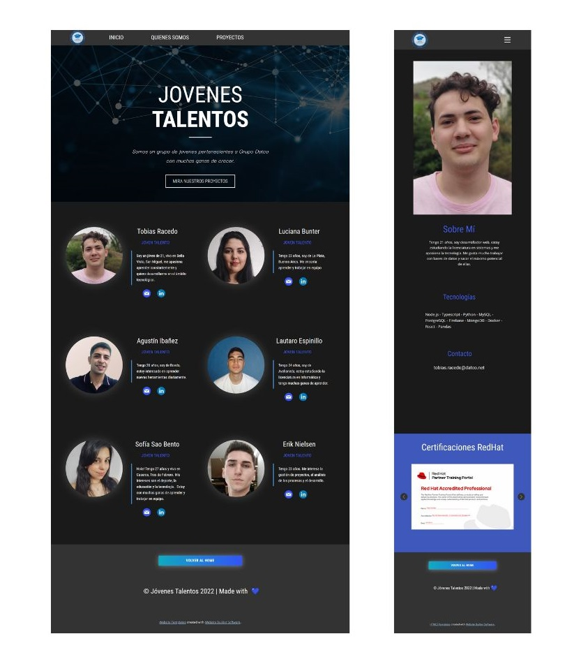
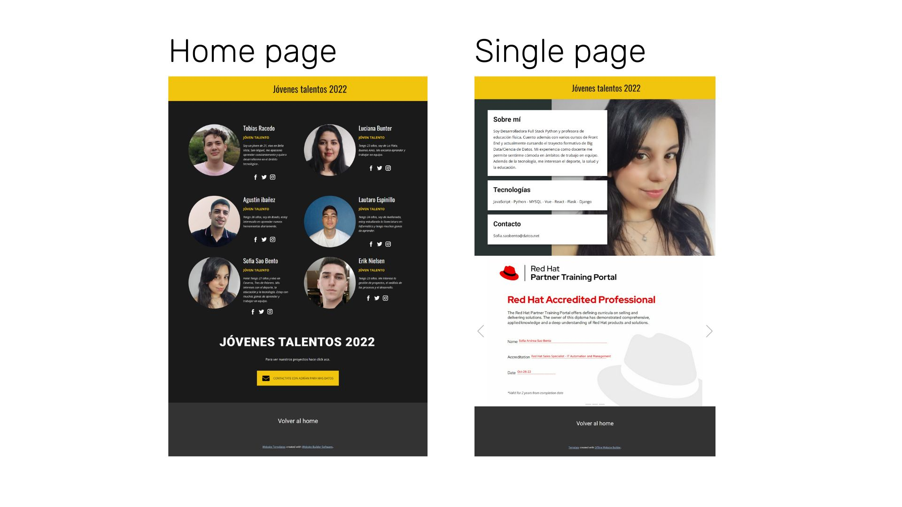

# Portfolio Jovenes Talentos
## [LIVE DEMO](https://thelaucha.github.io/JTH2---Portfolio/)

Esta es la solucion final para el portfolio de jovenes talentos.

## Proceso

Iniciamos con un protipo para darle forma a la idea...

###### Portfolio V1.0

## Autores

- [@Champler](https://github.com/Champler)
- [@Agustin2214](https://github.com/Agustin2214)
- [@TheLaucha](https://github.com/TheLaucha)
- [@sofiasaobento](https://github.com/sofiasaobento)
- [@N13LS3N](https://github.com/N13LS3N)
- [@lucibunter](https://github.com/lucibunter)

## Caracteristicas

- Responsive design
- Fullscreen mode
- Cross platform

## Tech Stack

- NICEPAGE
- HTML
- CSS
- JAVASCRIPT

## Referencias

 - [Nicepage](https://nicepage.com/)

